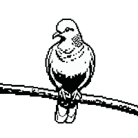

<div align="center">
  
</div>

# Gugu

English | [中文](README_CN.md)

A Go TUI (Terminal User Interface) framework inspired by [ratatui](https://github.com/ratatui-org/ratatui).

Gugu provides a complete set of tools for building rich terminal applications: layout system, text rendering, style system, terminal backends, and a wide range of built-in widgets.

## Features

- **Layout System** - Flexible constraint-based layout with Flex, Spacing, Margin, and Padding
- **Text System** - Full Unicode/UTF-8 support with grapheme-aware rendering, styled spans, and word wrapping
- **Style System** - ANSI 16 colors, 256-color, TrueColor RGB, modifiers, Material Design & Tailwind palettes
- **Terminal Backends** - ANSI, Native (macOS), Cross-platform (Unix/Windows), Test backend
- **Double Buffering** - Efficient diff-based rendering, only changed cells are written
- **Rich Widgets** - Block, Paragraph, List, Table, Input, Tabs, Gauge, BarChart, Chart, Canvas, Scrollbar, Sparkline, Calendar, Clear, Fill
- **Stateful Widgets** - List, Table, Scrollbar with external state management
- **Input Handling** - Full keyboard (F1-F12, modifiers, UTF-8) and mouse (SGR extended) support
- **Builder API** - Fluent builders for Layout, Span, Line, Text, and Table Row
- **Border Merging** - Automatic border intersection detection and merging
- **OSC 8 Hyperlinks** - Clickable terminal hyperlinks
- **Serde Support** - JSON serialization for Style, Color, Modifier
- **Test Utilities** - TestBackend and buffer assertion helpers

## Quick Start

```go
package main

import (
    "fmt"
    "os"
    "os/signal"
    "syscall"

    "github.com/rleecn/gugu/layout"
    "github.com/rleecn/gugu/style"
    "github.com/rleecn/gugu/terminal"
    "github.com/rleecn/gugu/widgets"
)

func main() {
    backend := terminal.NewNativeBackend()
    term, err := terminal.New(backend)
    if err != nil {
        fmt.Fprintf(os.Stderr, "Failed: %v\n", err)
        os.Exit(1)
    }

    backend.EnterAlternateScreen()
    backend.EnableRawMode()
    backend.HideCursor()
    defer func() {
        backend.ShowCursor(0, 0)
        backend.DisableRawMode()
        backend.ExitAlternateScreen()
    }()

    sigCh := make(chan os.Signal, 1)
    signal.Notify(sigCh, syscall.SIGWINCH, syscall.SIGINT, syscall.SIGTERM)

    // Key input channel
    keyCh := make(chan terminal.KeyEvent, 1)
    go func() {
        buf := make([]byte, 256)
        for {
            n, err := os.Stdin.Read(buf)
            if err != nil || n == 0 {
                close(keyCh)
                return
            }
            i := 0
            for i < n {
                ev, consumed := terminal.ParseKeySequence(buf[i:n])
                if consumed == 0 {
                    i++
                    continue
                }
                i += consumed
                keyCh <- ev
            }
        }
    }()

    // Draw
    frame := terminal.NewFrame(term)
    area := frame.Area()

    block := widgets.NewBlock().
        SetBorders(widgets.BorderAll).
        SetTitle(" Hello, Gugu! ").
        SetTitleStyle(style.NewStyle().Bold().SetFg(style.Yellow))

    para := widgets.NewParagraph("Welcome to Gugu TUI Framework!\n\nPress q to quit.").
        SetBlock(block).
        SetStyle(style.NewStyle().SetFg(style.White))

    frame.RenderWidget(para, area)
    term.Draw()
    term.Flush()

    // Wait for exit
    for {
        select {
        case <-sigCh:
            return
        case ev, ok := <-keyCh:
            if !ok || (ev.Code == terminal.KeyChar && ev.Text == "q") {
                return
            }
        }
    }
}
```

## Architecture

```
gugu/
├── buffer/       # Cell grid and diff engine
├── layout/       # Constraint-based layout system
├── style/        # Colors, modifiers, palettes, serde
├── symbols/      # Unicode border, bar, Braille, pixel symbols
├── terminal/     # Terminal backends, Frame, key/mouse parsing
├── text/         # Span, Line, Text, grapheme segmentation
└── widgets/      # Built-in widget implementations
```

See [docs/architecture.md](docs/architecture.md) for detailed architecture documentation.

## Widgets

| Widget | Description |
|--------|-------------|
| **Block** | Container with borders, titles, padding, shadow |
| **Paragraph** | Multi-line text with wrap, alignment, scroll, mask |
| **List** | Selectable list with highlight, scroll, direction |
| **Table** | Tabular data with column constraints, cell/column selection |
| **Input** | Single-line input with UTF-8, selection, clipboard, validation |
| **Tabs** | Horizontal tab bar with styled titles |
| **Gauge** | Progress bar with Unicode support |
| **LineGauge** | Thin line progress indicator |
| **BarChart** | Vertical bar chart |
| **Chart** | Line chart and scatter plot with axes and legend |
| **Canvas** | Braille-based pixel-level drawing (line, rect, circle) |
| **Scrollbar** | Vertical/horizontal scrollbar with custom symbols |
| **Sparkline** | Mini inline chart |
| **Calendar** | Monthly calendar with date highlighting |
| **Clear** | Clear an area (for overlays) |
| **Fill** | Fill an area with a symbol |

## Layout

```go
// Vertical layout: header(3) + content(fill) + footer(3)
areas := layout.Vertical(
    layout.NewLength(3),
    layout.NewFill(1),
    layout.NewLength(3),
).Split(area)

// Horizontal layout: sidebar(30) + main(fill)
areas := layout.Horizontal(
    layout.NewLength(30),
    layout.NewFill(1),
).Split(area)

// With Flex, Spacing, Margin
areas := layout.Vertical(
    layout.NewPercentage(25),
    layout.NewPercentage(75),
).SetFlex(layout.FlexSpaceBetween).
  SetSpacing(1).
  SetMargin(layout.Margin{Horizontal: 2}).
  Split(area)
```

## Style

```go
// Chained style
sty := style.NewStyle().SetFg(style.White).SetBg(style.Blue).Bold()

// RGB and indexed colors
sty := style.NewStyle().SetFg(style.Rgb(255, 128, 0))
sty := style.NewStyle().SetFg(style.Indexed(202))

// Material Design palette
sty := style.NewStyle().SetFg(style.Material.Blue[500])

// Tailwind CSS palette
sty := style.NewStyle().SetFg(style.Tailwind.Sky[400])

// Parse color from string
c := style.ParseColor("#ff8800")
c := style.ParseColor("index:202")
c := style.ParseColor("light-red")
```

## Text

```go
// Styled spans
line := text.NewLine(
    text.NewSpan("Hello ").SetStyle(style.NewStyle().SetFg(style.Green)),
    text.NewSpan("World").SetStyle(style.NewStyle().SetFg(style.Yellow).Bold()),
)

// Builder API
span := text.NewSpanBuilder("Hello").Fg(style.Red).Bold().Build()
line := text.NewLineBuilder().Span(span).Text(" World").Build()

// Shorthand functions
line := text.L(text.S("Hello", style.NewStyle().SetFg(style.Red)), text.NewSpan(" World"))
```

## Terminal Backends

```go
// Native backend (macOS, with raw mode and cursor position)
backend := terminal.NewNativeBackend()

// Cross-platform backend (Unix + Windows)
backend := terminal.NewCrossBackend()

// ANSI backend (writes to any io.Writer)
backend := terminal.NewAnsiBackend(os.Stdout)

// Test backend (for unit testing)
backend := terminal.NewTestBackend(80, 24)
```

## Viewport Modes

```go
// Fullscreen (default)
term, _ := terminal.New(backend)

// Inline (embedded in shell session)
term, _ := terminal.NewInline(backend, 20)

// Fixed (render at specific position)
term, _ := terminal.NewFixed(backend, 10, 5, 40, 20)
```

## Examples

See the [examples](examples/) directory:

- `demo/` - Full application demo with sidebar, input, and navigation
- `widgets/` - Scrollbar, Tabs, Gauge, Clear/Fill demo
- `layout/` - Layout constraints and Flex demo
- `paragraph/` - Text wrapping, alignment, and scrolling demo
- `list/` - Selectable list with state management demo
- `table/` - Table with column selection demo
- `style/` - Colors, modifiers, and palettes demo
- `canvas/` - Braille drawing demo
- `chart/` - Line chart and scatter plot demo
- `input/` - Text input with UTF-8 and selection demo
- `calendar/` - Monthly calendar demo

## Running Examples

```bash
# Run the main demo
go run ./examples/demo

# Run the widgets demo
go run ./examples/widgets

# Run a specific feature example
go run ./examples/layout
```

## License

MIT
